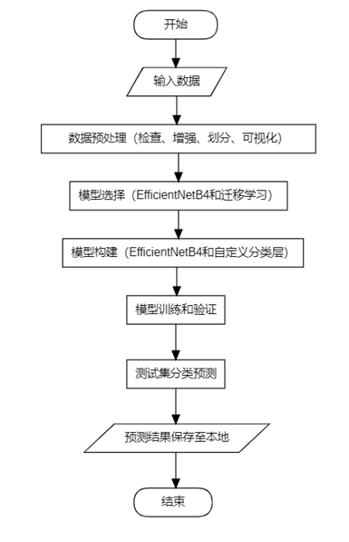
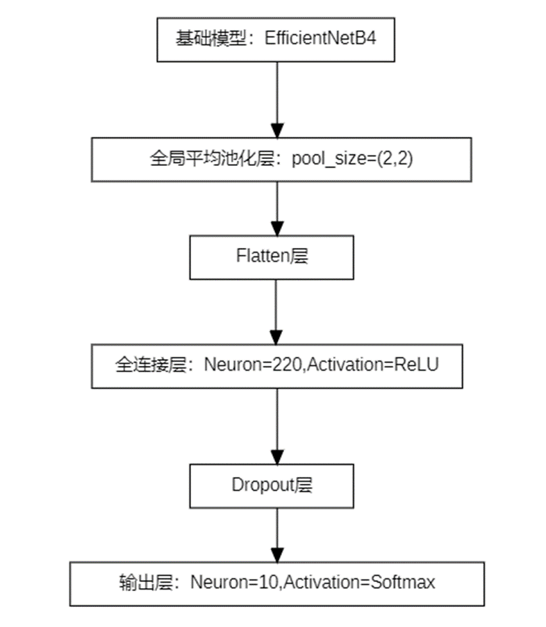

# 水稻病害分类模型
## 简介
这是本人深度学习课程的作业，  
基于EfficientNetB4开发了一个水稻病害分类模型，  
完成了Kaggle上的“Paddy Doctor: Paddy Disease Classification”竞赛目标，  
最终模型的分类准确率达0.96 。  
竞赛网址：https://www.kaggle.com/competitions/paddy-disease-classification/data  
最终模型的构建参考了Mehak Iftikhar等人的作品，并新增数据增强、解冻模型等操作。
## 目的
该竞赛的主要目标或任务是基于机器学习或深度学习的知识和给定的数据集，开发一个高性能的稻谷病害分类模型，并最终能够准确地将给定的稻谷图像数据分类为给定的10个类别之一。  
## 数据集描述
训练集：包含10,407张（75%）标记的稻谷图像，涵盖10个类别（9 种疾病和正常叶片）。  
测试集：包含3,469张（25%）标记的稻谷图片。
## 使用说明
将代码下载到本地，修改其中的路径为你下载到本地的数据的路径，这些数据需要从竞赛网址下载，然后直接运行即可
## 流程图

## 模型层次图

